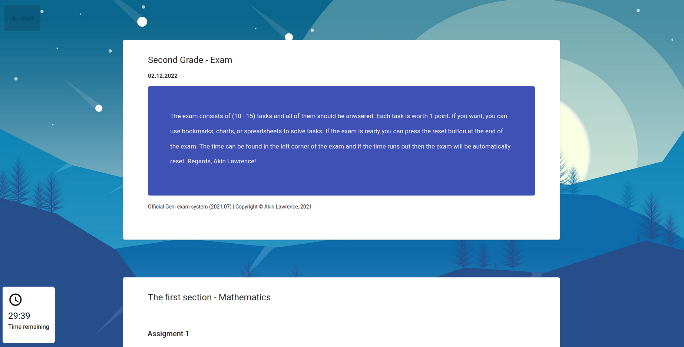

# Math website (Angular)

## Try the page
<a href="https://akinlawrence.github.io/math-website/index.html">Link to the website</a>

## About the project
The exam includes array, multiplication, divisions, comparison solving problems, and plus and minus calculations. To start the exam, press the "Perform an automatically generated training test" button, the timer will start and you will be able to complete the tasks. You will get to see the right answers after the exam, which will allow you to learn from your mistakes. Also you can practice each sections indivially by scrolling down in the page. There are two languages which can be selected from the top of the page if you want english or finnish!

# Why was this project made
I actually created it for fun while learning angular and I believe this would be helpful for many young kids struggling with math. Or just any kid that want to do some revision for example a test. 

# Plans for project
Currently there isn't any upcoming plans but hopefully in the future I will do other versions of this with more assignments!

## A Quick look of the front page

## The Exam it self

